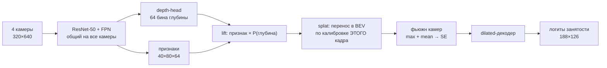

# Occupancy grid в bird's-eye view по четырём камерам

Решение финала **AIDAO 2025** — Международной олимпиады по искусственному интеллекту и анализу
данных (Яндекс Образование × ФКН НИУ ВШЭ). Задачу ставила команда беспилотных технологий Яндекса.
32 часа, очно, НИУ ВШЭ на Покровском бульваре, 29–30 ноября 2025.

**Результат — IoU 0.5606 на закрытом тесте.** Для калибровки: у команды-победителя олимпиады 0.564.

Архитектура — [Lift-Splat-Shoot](https://arxiv.org/abs/2008.05711), написанная с нуля на PyTorch.
Готовых BEV-фреймворков в решении нет.

---

## Задача

Машина едет по городу и трассе. На ней четыре камеры: две смотрят вперёд (широкая и длиннофокусная),
две — вбок. Нужно по одному кадру со всех четырёх восстановить, **что вокруг машины занято**, —
карту сверху размером 188×126 клеток на область 150 м вперёд и 100 м поперёк, примерно 0.8 м на клетку.

Разметка трёхзначная: свободно, занято, **неизвестно**. Неизвестные клетки не штрафуются — метрика и
лосс их маскируют. Метрика — средний IoU по двум классам.

К каждому кадру приложены калибровки всех камер: матрица внутренних параметров и матрица
перехода `car_to_cam`.

---

## Идея решения



Каждый пиксель признаковой карты — это луч в пространстве. Модель не знает, на каком расстоянии
вдоль луча находится объект, поэтому предсказывает **распределение по 64 бинам глубины** и
размазывает признак вдоль луча пропорционально вероятности. Точки, попавшие в одну клетку BEV,
складываются (`index_add_`). Всё дифференцируемо, никакой явной супервизии по глубине нет — она
выучивается из одного только occupancy-таргета.

---

## Что дало прирост

### 1. Покадровая калибровка (главное)

Базовый способ реализовать LSS — посчитать геометрию проекции один раз и переиспользовать. Так и
было в первой версии, и это стоило качества: калибровка в датасете **меняется от кадра к кадру**.

В финальной версии геометрия пересчитывается внутри `forward` для каждого сэмпла из его собственных
`intrinsics` и `car_to_cam`. Отсюда и название ноутбука.

Вторая половина той же проблемы, менее очевидная: изображения перед бэкбоном ресайзятся до 320×640,
а `intrinsics` описывают **исходный** кадр. Причём у четырёх камер исходные разрешения разные —
546, 568, 540 и 540 строк при ширине 1024. Если не вернуть сетку пикселей в координаты исходного
изображения перед умножением на `K⁻¹`, лучи уходят мимо, и картинка в BEV разъезжается тем сильнее,
чем дальше объект. Поэтому датасет отдаёт `orig_hw` вместе с картинками, а модель делит координаты
на масштаб ресайза.

### 2. Лосс, оптимизирующий целевую метрику

```
loss = BCE(pos_weight ≈ 1.196) + 0.3 · (1 − soft_mIoU)
```

`soft_mIoU` — дифференцируемый суррогат метрики: те же IoU по двум классам, но по вероятностям
вместо порога, с той же маской неизвестных клеток. Одна BCE оптимизирует не то, по чему считается
скор; одна soft-IoU хуже сходится в начале. Вместе — стабильнее и ближе к метрике.

`pos_weight` не подобран на глаз, а посчитан по фактическому балансу классов на 50 батчах:
381 269 занятых клеток против 456 110 свободных.

### 3. Обучаемая температура softmax в depth-head

Температура распределения по глубине — параметр модели, зажатый в `[0.3, 3.0]`. В начале обучения
модели выгодно размазывать массу по бинам, ближе к концу — заострять. Ручной подбор этого шага
съел бы время, которого на 32-часовом финале нет.

### 4. Калибровка порога

Порог бинаризации лосс не видит вовсе, и 0.5 не обязан быть оптимумом. Свип по валидации:

| порог | mIoU | IoU свободно | IoU занято |
|-------|------|--------------|------------|
| 0.45 | 0.7662 | 0.7820 | 0.7504 |
| 0.50 | 0.7688 | 0.7880 | 0.7497 |
| **0.55** | **0.7691** | 0.7917 | 0.7464 |
| 0.60 | 0.7670 | 0.7935 | 0.7405 |
| 0.65 | 0.7618 | 0.7927 | 0.7308 |

Выигрыш маленький, но важнее то, что кривая **плоская** вокруг оптимума: значит, это не подгонка
под шум, и на закрытом тесте порог не развалится.

---

## Архитектура

| Блок | Что делает |
|------|-----------|
| `ResNet50Backbone` | ImageNet-ResNet-50 до `layer3`, FPN-слияние уровней /8 и /16. Общий на все камеры — в четыре раза меньше параметров и одинаковые признаки у всех видов |
| `DepthHead` | Residual-блок + проекция 1×1 в 64 канала глубины, softmax с обучаемой температурой |
| `_compute_bev_indices_for_cam` | Геометрия: `K⁻¹` → лучи → 64 бина глубины → `cam→car` → отсечение по высоте `Z ∈ [−1, 3]` → индекс клетки BEV |
| `lift_splat_single_cam` | Взвешивание признаков вероятностью глубины и `index_add_` в сетку |
| Фьюжн камер | `max` + `mean` по камерам, конкатенация, conv-BN-ReLU, SE-блок. `max` берёт самую уверенную камеру, `mean` — согласие между ними |
| BEV-контекст | Два residual-блока с dilation 2 и 4 — рецептивное поле на всю сетку без потери разрешения |
| Декодер | Residual-блоки + dropout → один канал логитов |

Обучение: AdamW с раздельными lr (бэкбон 1e-4, головы 5e-4, предобученному нужен меньший шаг),
cosine annealing, mixed precision, фотометрические аугментации на GPU, 10 эпох, батч 8.
Инференс — 2000 кадров за 1 мин 41 с, около 20 кадров в секунду на одной GPU.

Полный лог прогона: [`results/training_log.txt`](results/training_log.txt).

---

## Честные оговорки

- **Числа валидации в логе не являются чистой валидацией.** Финальный прогон обучался на
  `train + val`, а `val` остался в цикле только как индикатор прогресса. Единственная честная
  цифра здесь — 0.5606 на закрытом тесте.
- **Данных в репозитории нет.** Датасет олимпиады не публиковался, выложить его я не могу.
  Ноутбук — это код решения, а не воспроизводимый с нуля пайплайн.
- **Веса не приложены** (39 МБ). Могу выслать по запросу.
- Олимпиада командная, три человека. Здесь — код финального решения.

## Что стоило бы сделать иначе

Что не влезло в 32 часа и куда я бы пошёл дальше:

- **Свой цикл вместо `index_add_` по батчу.** Splat сейчас идёт питоновским циклом по элементам
  батча — это узкое место инференса. Векторизация через сегментную сумму дала бы ускорение без
  изменения результата.
- **Временной контекст.** Задача решается по одному кадру, хотя данные — это записи поездок.
  Агрегация нескольких кадров с учётом эго-движения — самый очевидный источник качества.
- **Честный holdout.** Тренировка на `train + val` дала прирост, но лишила возможности мерить.
  На длинной дистанции это плохой размен.
- **Аугментации в BEV, а не только фотометрические.** Отражение по поперечной оси с
  соответствующим преобразованием калибровки — дешёвое удвоение данных.

---

## Как запустить

```bash
pip install -r requirements.txt
jupyter lab notebooks/lss_bev_occupancy.ipynb
```

Ноутбук ждёт рядом каталоги `train/`, `val/`, `test/`, в каждом — `info.csv` со ссылками на
изображения, `.npy`-калибровки и occupancy-сетки. Пути к данным задаются в первой ячейке
(`DATA_ROOT`), веса ResNet-50 подтягиваются из torchvision, если не указать локальный файл.

## Структура

```
notebooks/lss_bev_occupancy.ipynb   решение целиком: датасет, геометрия, модель, обучение, сабмит
results/training_log.txt            stdout финального прогона на олимпиаде
requirements.txt
```

---

## Про олимпиаду

AIDAO — командная олимпиада (2–3 человека) от Яндекс Образования и факультета компьютерных наук
НИУ ВШЭ, проводится с 2018 года (до 2023 — под названием IDAO). Рабочий язык английский, участники —
студенты со всего мира.

В 2025 году: 248 команд из 14 стран, отборочный этап онлайн в Яндекс Контесте (задача про
исправление ошибок в квантовом распределении ключей от лаборатории LAMBDA ФКН и компании QRate),
30 команд в очном финале в Москве. Финальная задача — эта.

---

<details>
<summary><b>English summary</b></summary>

Final-round solution for **AIDAO 2025** (AI and Data Analysis Olympiad, Yandex Education × HSE
Faculty of Computer Science). The task, set by Yandex's self-driving team, was to reconstruct a
static occupancy grid in bird's-eye view from four calibrated onboard cameras — a 188×126 grid
covering 150 m × 100 m, scored by mean IoU over `{free, occupied}` with an ignore label.
32 hours, on site at HSE Moscow, 29–30 November 2025.

**Result: IoU 0.5606 on the private test set** (the winning team scored 0.564).

Lift-Splat-Shoot implemented from scratch in PyTorch: a shared ResNet-50/FPN backbone, a
categorical depth head with a learned softmax temperature, a differentiable splat into the BEV
grid, max+mean camera fusion with squeeze-and-excitation, and a dilated residual decoder.

The main source of improvement was recomputing the projection geometry **per frame** from that
frame's intrinsics and `car_to_cam` — the calibration varies between frames, and the four cameras
have different native resolutions, so the feature grid has to be mapped back to original image
coordinates before rays are cast. Secondary gains came from training against a differentiable
mean-IoU surrogate alongside class-weighted BCE, and from calibrating the decision threshold on a
sweep rather than assuming 0.5.

Note that the final run trains on `train + val`, so the validation numbers in the log track
progress only; the private test score is the one honest number. The competition dataset was never
published and is not included here.

</details>
