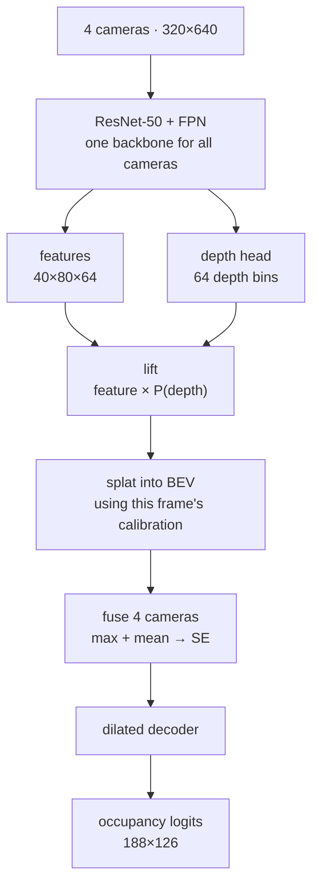

# Occupancy grid in bird's-eye view from four cameras

Final-round solution for **AIDAO 2025**, the AI and Data Analysis Olympiad run by Yandex Education
and the HSE Faculty of Computer Science. The task was set by Yandex's self-driving team. 32 hours
on site at HSE, Pokrovsky Boulevard, Moscow, 29–30 November 2025.

**Result: IoU 0.5606 on the private test set.** For calibration, the winning team scored 0.564.

The architecture is [Lift-Splat-Shoot](https://arxiv.org/abs/2008.05711), written from scratch in
PyTorch. No off-the-shelf BEV framework is used anywhere in the solution.

---

## The task

A car drives through city and highway scenes. It carries four cameras, two facing forward (a wide
one and a long-focus one) and two facing sideways. From a single frame of all four, reconstruct
**what is occupied around the car** as a top-down map of 188×126 cells covering 150 m ahead and
100 m across, roughly 0.8 m per cell.

Labels are three-valued: free, occupied, and **unknown**. Unknown cells carry no penalty, and both
the metric and the loss mask them out. The organizers scored submissions with the standard
`IoU = TP / (TP + FP + FN)`. This solution additionally tracks a mean IoU over both classes
locally, and trains against a differentiable surrogate of it, which was a choice made during the
contest rather than part of the stated metric. See [`references/`](references/) for the brief.

Every frame ships with the calibration of all four cameras, an intrinsics matrix and a `car_to_cam`
transform.

---

## The idea



Every pixel of the feature map is a ray in space. The model does not know how far along that ray
an object sits, so it predicts a **distribution over 64 depth bins** and smears the feature along
the ray in proportion to that probability. Points that land in the same BEV cell are summed
(`index_add_`). The whole path is differentiable, and there is no explicit depth supervision
anywhere. Depth is learned from the occupancy target alone.

---

## What moved the score

### 1. Per-frame calibration (the big one)

The straightforward way to implement LSS is to compute the projection geometry once and reuse it.
That is what the first version did, and it cost accuracy, because calibration in this dataset
**changes from frame to frame**.

In the final version the geometry is recomputed inside `forward` for every sample, from that
sample's own `intrinsics` and `car_to_cam`. Hence the name of the notebook.

The second half of the same problem is less obvious. Images are resized to 320×640 before the
backbone, while the intrinsics describe the **original** frame. On top of that, the four cameras
have different native resolutions: 546, 568, 540 and 540 rows at a width of 1024. Without mapping
the pixel grid back into original image coordinates before multiplying by `K⁻¹`, the rays go off
target, and the BEV picture smears more the further away an object is. That is why the dataset
returns `orig_hw` alongside the images and the model divides coordinates by the resize scale.

### 2. A loss that optimises the target metric

```
loss = BCE(pos_weight ≈ 1.196) + 0.3 · (1 − soft_mIoU)
```

`soft_mIoU` is a differentiable surrogate for the metric, the same two-class IoU computed on
probabilities instead of thresholded predictions, with the same mask over unknown cells. BCE alone
optimises something other than the score. Soft IoU alone converges poorly early on. Together they
are stable and stay close to the metric.

`pos_weight` is measured rather than guessed, from the actual class balance over 50 batches:
381,269 occupied cells against 456,110 free ones.

### 3. A learned softmax temperature in the depth head

The temperature of the depth distribution is a model parameter clamped to `[0.3, 3.0]`. Early in
training the model benefits from spreading mass across bins, and later from sharpening it. Tuning
that schedule by hand would have eaten time a 32 hour final does not have.

### 4. Threshold calibration

The loss never sees the decision threshold, and 0.5 has no reason to be optimal. Sweeping it on
validation:

| threshold | mIoU | IoU free | IoU occupied |
|-----------|------|----------|--------------|
| 0.45 | 0.7662 | 0.7820 | 0.7504 |
| 0.50 | 0.7688 | 0.7880 | 0.7497 |
| **0.55** | **0.7691** | 0.7917 | 0.7464 |
| 0.60 | 0.7670 | 0.7935 | 0.7405 |
| 0.65 | 0.7618 | 0.7927 | 0.7308 |

The gain is small, and the more useful observation is that the curve is **flat** around the
optimum. That means the choice is not fitting noise and the threshold will not fall apart on the
hidden test set.

---

## Architecture

| Block | What it does |
|-------|--------------|
| `ResNet50Backbone` | ImageNet ResNet-50 truncated at `layer3`, FPN merge of the /8 and /16 levels. Shared across cameras, which means four times fewer parameters and consistent features across views |
| `DepthHead` | Residual block plus a 1×1 projection into 64 depth channels, softmax with a learned temperature |
| `_compute_bev_indices_for_cam` | Geometry. `K⁻¹` to rays, 64 depth bins, `cam→car`, height gate `Z ∈ [−1, 3]`, then a flat BEV cell index |
| `lift_splat_single_cam` | Weights features by depth probability and scatters them with `index_add_` |
| Camera fusion | `max` and `mean` across cameras, concatenated, conv-BN-ReLU, then an SE block. Max keeps the most confident camera, mean keeps the agreement between them |
| BEV context | Two residual blocks with dilation 2 and 4, giving a receptive field over the whole grid without losing resolution |
| Decoder | Residual blocks and dropout into a single logit channel |

Training used AdamW with separate learning rates (1e-4 for the backbone, 5e-4 for the heads, since
a pretrained backbone wants smaller steps), cosine annealing, mixed precision, photometric
augmentation on GPU, 10 epochs, batch size 8. Inference runs 2000 frames in 1 minute 41 seconds,
about 20 frames per second on a single GPU.

Full run log: [`results/training_log.txt`](results/training_log.txt).

---

## Honest caveats

- **The validation numbers in the log are not a clean validation.** The final run trains on
  `train + val`, and `val` stays in the loop purely as a progress signal. The only honest number
  here is 0.5606 on the private test set.
- **The data is not in this repository.** The competition dataset was never published, so I cannot
  share it. The notebook is the solution code rather than a pipeline reproducible from scratch.
- **Weights are not attached** (39 MB). Available on request.
- The olympiad is a team event with three people. This is the code of the final solution.

## What I would do differently

Things that did not fit into 32 hours, and where I would go next.

- **Replace the per-sample loop around `index_add_`.** The splat currently iterates over the batch
  in Python, which is the bottleneck at inference. A segment-sum formulation would speed it up
  without changing the result.
- **Use temporal context.** The task is solved frame by frame even though the data comes from
  driving sessions. Aggregating several frames with ego-motion is the most obvious source of
  accuracy left on the table.
- **Keep an honest holdout.** Training on `train + val` helped the score and removed any ability to
  measure. Over a longer horizon that is a bad trade.
- **Augment in BEV, not only photometrically.** A lateral flip with the matching transform of the
  calibration is a cheap way to double the data.

---

## Running it

```bash
pip install -r requirements.txt
jupyter lab notebooks/lss_bev_occupancy.ipynb
```

The notebook expects `train/`, `val/` and `test/` directories next to it, each with an `info.csv`
pointing at images, `.npy` calibration files and occupancy grids. Data paths live in the first cell
(`DATA_ROOT`). ResNet-50 weights are pulled from torchvision unless a local file is given.

## Layout

```
notebooks/lss_bev_occupancy.ipynb   the whole solution: dataset, geometry, model, training, submission
results/training_log.txt            stdout of the final contest run
references/README.md                the task as specified, and the architectures it pointed at
requirements.txt
```

---

## About the olympiad

AIDAO is a team olympiad (two to three people) run by Yandex Education and the HSE Faculty of
Computer Science, held since 2018 and known as IDAO until 2023. The working language is English
and participants are students from around the world.

In 2025 there were 248 teams from 14 countries. The online qualifier ran on Yandex Contest with a
problem on error correction in quantum key distribution, set by the LAMBDA lab at HSE and the
company QRate. Thirty teams reached the on-site final in Moscow, where this task was set.
